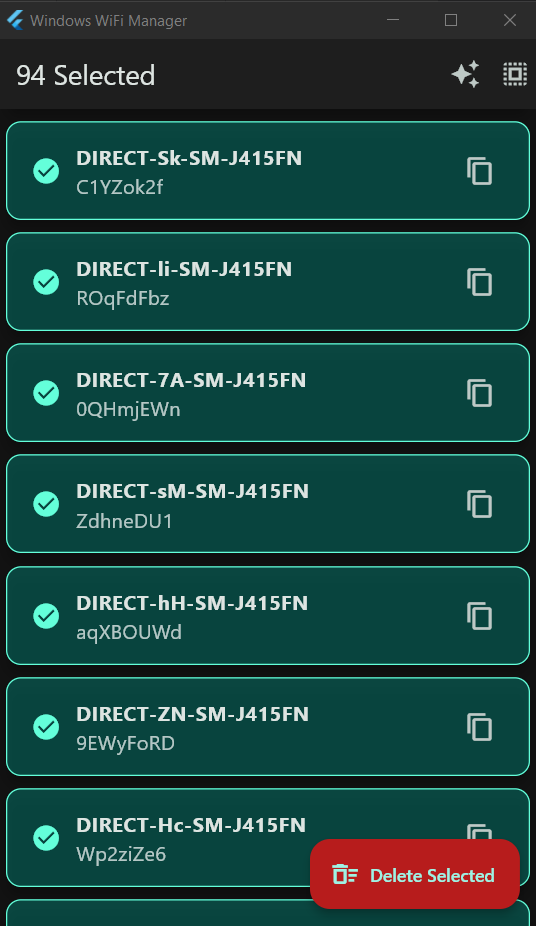

# Windows WiFi Manager

<div align="center">
  
</div>

## Overview

A professional Flutter desktop application for managing Windows WiFi profiles. View saved WiFi passwords, organize profiles, and manage network settings with ease.

## Features

- **View WiFi Passwords** - Display all saved WiFi profiles with their passwords
- **Auto-select DIRECT Profiles** - Quickly select "DIRECT-" prefixed profiles (e.g., DIRECT-*-SM-J415FN)
- **Select/Deselect All** - Toggle selection for all profiles at once
- **Copy Password** - One-click copy password to clipboard
- **Delete Profiles** - Remove selected WiFi profiles with confirmation dialog
- **Dark Theme** - Professional dark mode UI with Material 3 design

## Technical Details

| Property | Value |
|----------|-------|
| **App Name** | Windows WiFi Manager |
| **Window Size** | 450 x 750 pixels |
| **Minimum Size** | 400 x 600 pixels |
| **Framework** | Flutter |
| **UI Theme** | Material 3 Dark Mode |
| **Primary Color** | Teal |
| **Background** | #121212 |
| **Cards** | #1E1E1E |

## App Structure

```
WifiManagerApp (Main App)
├── WifiListScreen (Home Screen)
│   ├── Loading State
│   │   └── CircularProgressIndicator
│   └── Profile List
│       └── WifiProfile Cards
│           ├── Name Display
│           ├── Password Display
│           ├── Copy Button
│           └── Selection Toggle
```

## Data Model

```dart
class WifiProfile {
  final String name;      // WiFi profile name
  final String password;  // WiFi password (or status message)
}
```

## Key Features

### Selection Features
- Tap to select/deselect individual profiles
- Auto-select "DIRECT-" profiles with pattern matching
- Select/Deselect all profiles at once

### Profile Status Messages
- `Not found / Open network` - Open network without password
- `Permission Denied (Run as Admin)` - Requires administrator privileges
- `Error! Please run as Administrator` - Initial load error

### Window Configuration
- Centered on screen
- Normal title bar style
- Resizable with minimum constraints

## System Requirements

- Windows Operating System
- Administrator privileges (for viewing/deleting profiles)
- Flutter SDK
- `window_manager` package
- `process` package

## Dependencies

```yaml
dependencies:
  flutter/material.dart
  flutter/services.dart
  process/process.dart
  window_manager/window_manager.dart
```

## Commands Used

```bash
# List all WiFi profiles
netsh wlan show profiles

# Get password for specific profile
netsh wlan show profile name="PROFILE_NAME" key=clear

# Delete a profile
netsh wlan delete profile name="PROFILE_NAME"
```

## Build & Run

```bash
# Install dependencies
flutter pub get

# Run the application
flutter run
```

> **Note:** Run the application as Administrator for full functionality.
